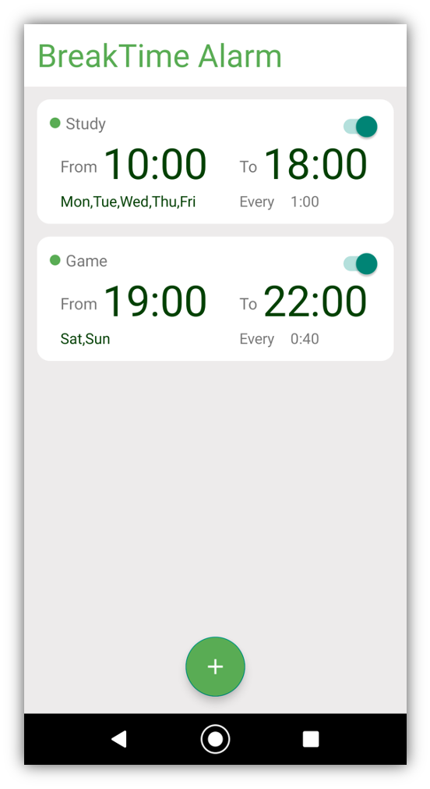
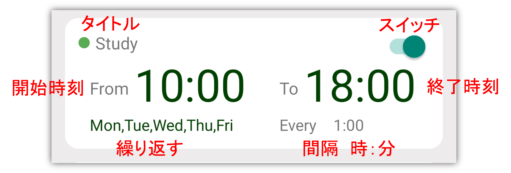
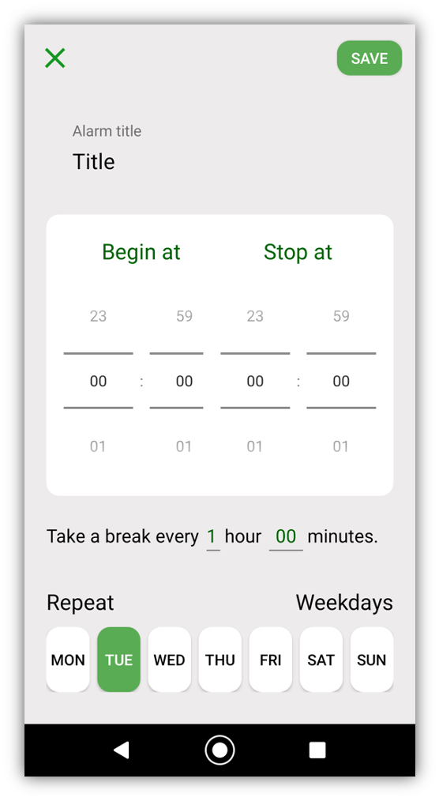
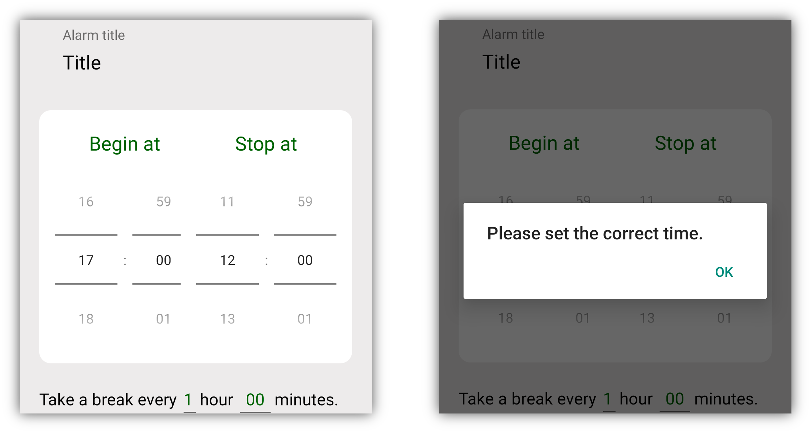
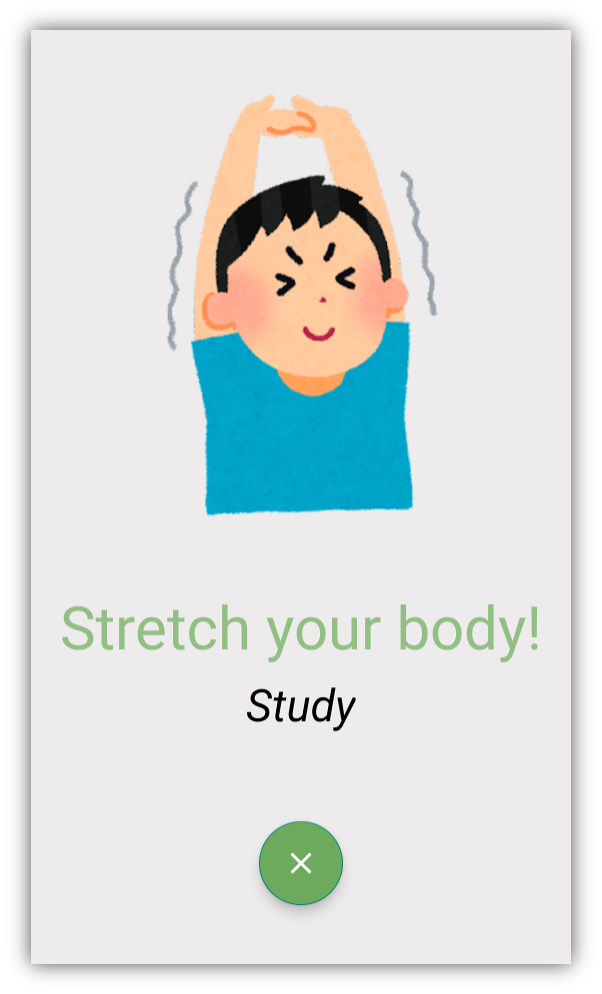

# BreakTimeAlarm
ユーザーが設定した間隔で、休憩やストレッチをリマインドしてくれるアプリ。

### 背景
勉強中に時々体を動かすと、体の痛みを防いだり、勉強の効率を上げたりすることができます。

### 基本機能
アプリで開始時間、終了時間、リマインダー間隔を設定すると、期間中に適切な運動をするようリマインダーが表示されます。

### インターフェース
#### 設定画面

各アラームは、メインページに表示されます。

メイン画面の「＋」ボタンを押すか、アラームエリアを押すと、アラーム編集画面になります。

時刻が正しく設定されていない場合、アプリは編集を拒否します。

#### リマインダー画面

